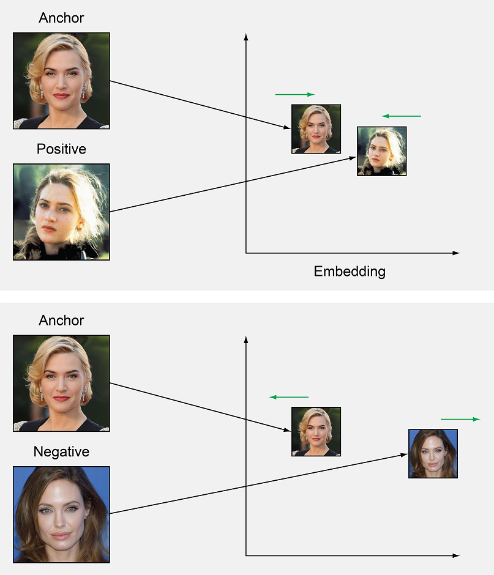
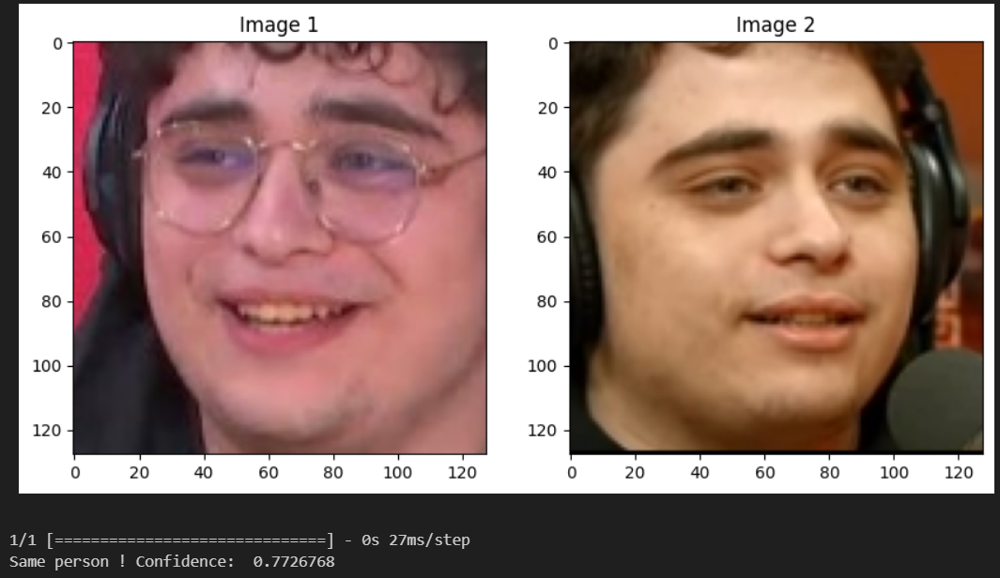
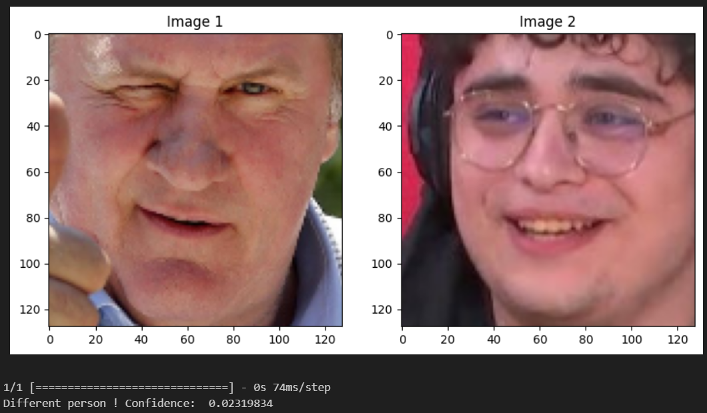

# One-Shot Face recognition using Triplet Network

The goal of one-shot face recognition is to recognize someone just using 1 picture of that person. This is a very challenging task, and it is not easy to achieve high accuracy. In this project, I have used a triplet network to achieve this task. The triplet network is a type of neural network that learns to recognize an object by learning to differentiate between similar and dissimilar objects. The triplet network is trained using a loss function called the triplet loss function, which is designed to minimize the distance between similar objects and maximize the distance between dissimilar objects.

# Dataset

[Face Recognition Dataset, derived from the Labeled Faces in the Wild Datase](https://www.kaggle.com/datasets/stoicstatic/face-recognition-dataset)

# Results

Note: The model is not perfect, and the method of face extraction currently use (face_extraction python package) is not perfect. The model is trained on a small dataset, and the model is not very deep. The model can be improved by using a deeper model and a larger dataset.

# What hyperparameters

Look at `config.yaml`

# My motivations

I undertook this project as a follow-up to a very similar one I completed about a year ago. My intention was to revisit the project and execute it in a more polished and professional manner, leveraging the knowledge I have acquired since then. Ultimately, I am quite pleased with the outcome.

# Workshop

I did a quick presentation on this project for students at the Epitech Montpellier school. If you understand French, you can spread the knowledge with [this pdf](Workshop%20-%20Découvrir%20l’intelligence%20artificielle%20à%20travers%20un%20exemple.pdf)

# Inspitations from

https://arxiv.org/abs/1707.02131
https://www.kaggle.com/code/stoicstatic/face-recognition-siamese-w-triplet-loss/notebook
